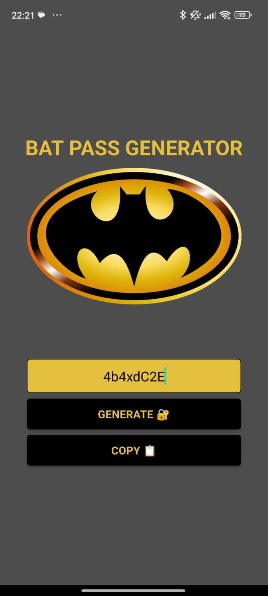

# Password Generator

Projeto desenvolvido em React Native para conclusão do módulo1 da Formação ReactNative Developer da DIO.

## 🛠️ Preview da tela

## 🛠️ Tecnologias empregadas

Mencione as ferramentas que você usou para criar seu projeto

* [ReactNative](https://reactnative.dev/)
* [NodeJS](https://nodejs.org/en)
* [Expo](https://expo.dev/)
